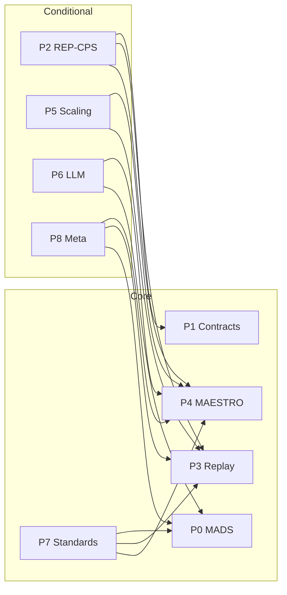

# Integration contracts

Each paper has a defined kernel ownership and integration contract so the portfolio stays coherent. Below: kernel ownership, consumes, produces, and must-not-own for each paper.

| Paper | Kernel ownership | Consumes | Produces | Must not own |
|-------|------------------|----------|----------|--------------|
| **P0 MADS-CPS** | Assurance kernel (tiers, admissibility, PONRs, evidence bundle semantics) | — | EVIDENCE_BUNDLE, RELEASE_MANIFEST, VERIFICATION_MODES; conformance checker; lab profile semantics | Trace/replay mechanics (P3), benchmark substrate (P4), coordination semantics (P1) |
| **P1 Contracts** | Coordination semantics (authority, valid writes, time model) | — | COORD_CONTRACT, OPC_UA_LADS_MAPPING; validator; contract-enforcing store | —; MADS owns gating; Replay owns trace/replay |
| **P2 REP-CPS** | Protocol profile (schemas, rate limits, provenance, robust aggregation) | Contracts typed state; Replay/MAESTRO harnesses | REP_CPS_PROFILE; aggregator; MAESTRO adapter | Full MADS envelope (profile inside it only) |
| **P3 Replay** | Trace/replay kernel (trace semantics, replay levels, divergence detection) | — | TRACE, REPLAY_LEVELS; replay engine; evidence-bundle integration | —; MAESTRO consumes traces; MADS consumes replay outcomes |
| **P4 CPS-MAESTRO** | Evaluation kernel (scenarios, fault models, scoring, report format) | — | MAESTRO_REPORT; scenario definitions; adapter interface; dataset release | —; must emit traces (P3) and evidence (MADS) compatible |
| **P5 Scaling laws** | None (consumes only) | MAESTRO datasets; Replay traces | Feature extractor; modeling code; architecture recommendation CLI | — |
| **P6 LLM Planning** | LLM runtime (typed plan schema, validator, toolcalling capture) | MAESTRO scenarios | TYPED_PLAN; validator; red-team suite; MAESTRO adapter | Full assurance; containment + robustness only |
| **P7 Standards mapping** | Assurance-pack templates (hazards→controls→evidence→audit) | MADS tiers/PONRs; Replay and MAESTRO trace/report artifacts | ASSURANCE_PACK; hazard log template; lab instantiation; mapping checker | — |
| **P8 Meta-coordination** | Meta-controller (switching criteria, safety constraints) | MAESTRO; Replay; MADS PONRs as invariant | Meta-controller spec; MAESTRO scenarios for regime stress; eval artifacts (`comparison.json`, optional `scenario_regime_stress_v1/`, `verify_p8_meta_artifacts.py`) | —; safety (PONRs) invariant across regimes |

## Dependency overview

Release train: **MAESTRO** (P4) and **Replay** (P3) are the default path; other papers produce artifacts compatible with them or consume their datasets. **MADS** (P0) owns tiers, admissibility, and PONRs; **Contracts** (P1) owns valid writes and authority; **Replay** (P3) owns trace and replay semantics.

**Reference organism:** The canonical scenario anchoring the portfolio is **lab_profile_v0** (`bench/maestro/scenarios/lab_profile_v0.yaml`). Every paper touches it at least once (instantiation or eval); scaling is anchored to resource graphs, campaign concurrency, heterogeneity, and fault recovery rather than raw agent count.
